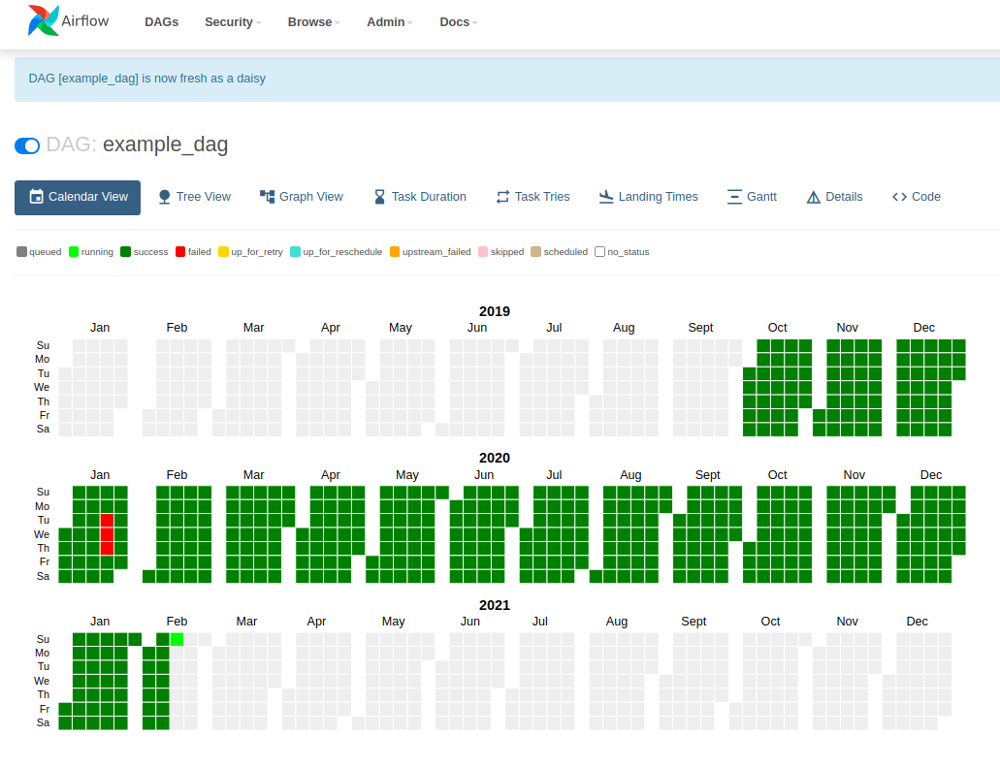
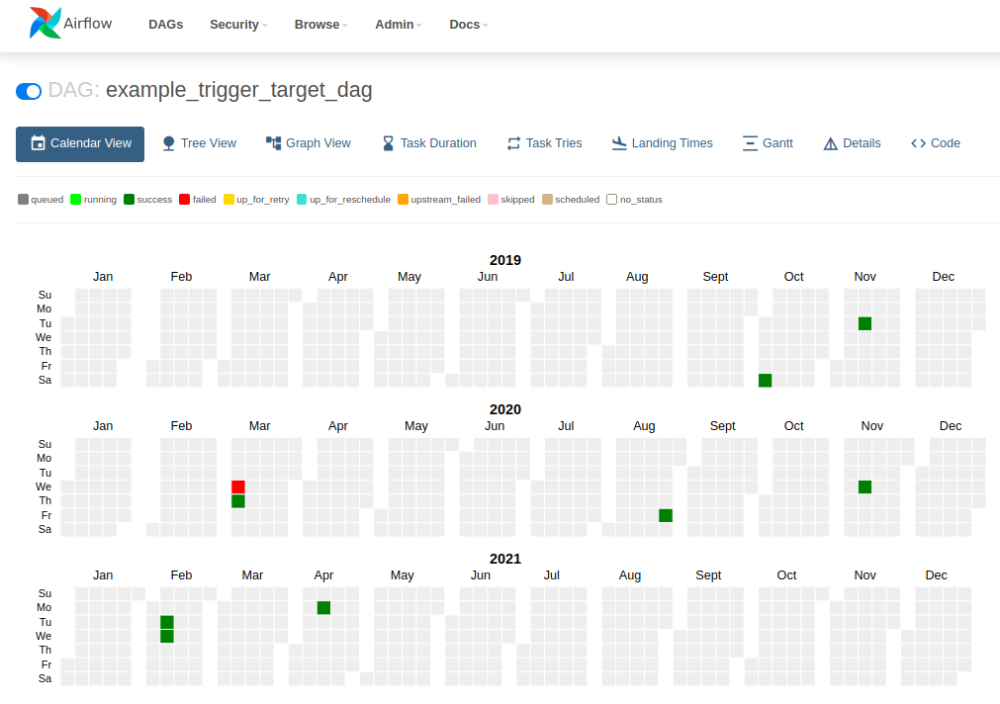
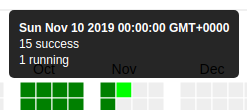

# Calendar View proposal

## Goals
- Provide better visibility over the full state of the DAG since the start date.
- Make it easier to track the progress of large backfills at a glance.

## Screenshots & Usage

### Hourly scheduled dag:


### Manually triggered dag:


### How to read the calendar
- The endpoint returns, for each day, the number of dag runs in each state (failed, success, ...).

- The "state" displayed for a given day is picked among the states of the dag runs for that day, according to the
default state priority list:
    ```
    failed > upstream_failed > up_for_retry > up_for_reschedule > queued > scheduled > sensing > running > shutdown > removed > no_status > success > skipped
    ```

    I.e. on the screenshot above, for the 22nd of January 2020, there are 23 dag runs with state `success`, and one
    dag run with state `failed`.
    - Because `failed` has a higher priority than `success`, the day is displayed as `failed`.
    - When retrying the failed task, the dag run is marked as `running` which has priority over `success`.
    At this point the day is displayed as `running`.
    - Once the task succeeds, the dag run is marked as `success`. There are now 24 dag runs with state `success` for
    that day. The day is thus displayed as `success`.

- For each day, a tooltip shows the number of dag runs for each state for that day:



- Clicking on a day redirects to the tree view for that day to show all the dag runs until the end of that day.

## High-level implementation
- New `/calendar` endpoint in `views.py`.
- New `calendar.html` template and `calendar.js` script.
- The calendar JS logic uses d3 & moment (already airflow dependencies, no version bump required).
